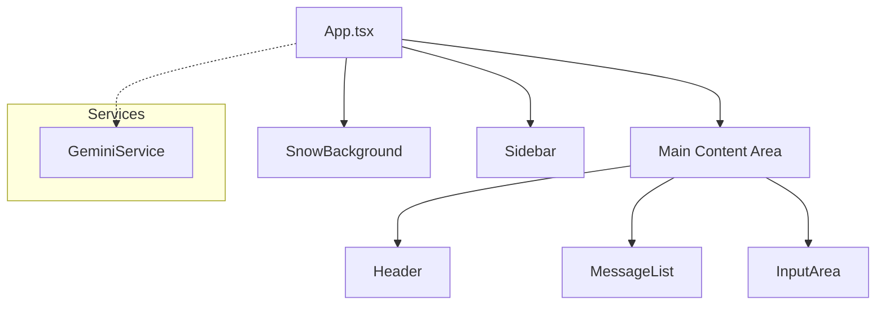

# Application Architecture Breakdown

## Overview

Gemini Omni Chat is a client-side React application built with TypeScript and Vite. It serves as a rich, multimodal interface for Google's Gemini models. The application is designed with a "snow" theme and emphasizes real-time streaming and responsive design.

## Component Hierarchy

The application follows a simple but effective component tree structure:

### Key Components

*   **App.tsx**: The root component and "controller". It manages global state (chat history, configuration, loading state) and coordinates communication between the UI and the Gemini service.
*   **Sidebar.tsx**: Handles model selection (Flash, Pro, Coding, etc.) and configuration parameters (Thinking Mode, Grounding, Budget). It adapts to mobile screens as a drawer.
*   **MessageList.tsx**: Renders the chat history. Handles different message types (user/model), markdown rendering, code highlighting, and displaying generated images or grounding sources.
*   **InputArea.tsx**: Captures user input (text and image files) and triggers the send action.
*   **SnowBackground.tsx**: Provides the ambient visual theme.

## State Management

State is primarily managed in `App.tsx` using React `useState` and `useEffect`.

| State Item | Description | Persistence |
| :--- | :--- | :--- |
| `messages` | Array of chat messages (User/Model). | **Yes** (localStorage) |
| `config` | Current model settings (Model ID, Thinking, Grounding). | No (Session only) |
| `isLoading` | Boolean flag for stream status. | No |
| `isSidebarOpen` | UI state for mobile navigation. | No |

## Data Flow: Sending a Message

1.  **User Action**: User types text/uploads image in `InputArea` and hits send.
2.  **Optimistic UI**: `handleSendMessage` in `App.tsx` immediately adds the User message to the `messages` state.
3.  **Placeholder**: A temporary "empty" Model message is added to the state to catch the incoming stream.
4.  **Service Call**: `geminiService.streamMessage` is called with the text, images, and current `config`.
5.  **Streaming**:
    *   The service establishes a `chatSession` with the specific model (e.g., `gemini-3-pro-preview`).
    *   It yields chunks containing `text`, `groundingSources`, or `generatedImages`.
6.  **Update Loop**: `App.tsx` consumes these chunks and iteratively updates the placeholder Model message, creating a real-time typing effect.
7.  **Error Handling**: If the stream fails (e.g., 429 Limit), the placeholder message is updated with a helpful error description.

## Service Layer (`geminiService.ts`)

This singleton service encapsulates the Google GenAI SDK interaction.

*   **`streamMessage`**: The core function. It:
    *   Validates the API Key.
    *   Maps "virtual" models (like `gemini-code-assistant`) to real endpoint models.
    *   Builds the specialized `generationConfig` (injecting system instructions, tools, or thinking budgets).
    *   Normalizes the response stream into a unified format for the UI.

## Tech Stack

*   **Framework**: React 19 + Vite
*   **Styling**: Tailwind CSS
*   **Icons**: Lucide React
*   **AI SDK**: `@google/genai` (Official SDK)